# ProgramOne

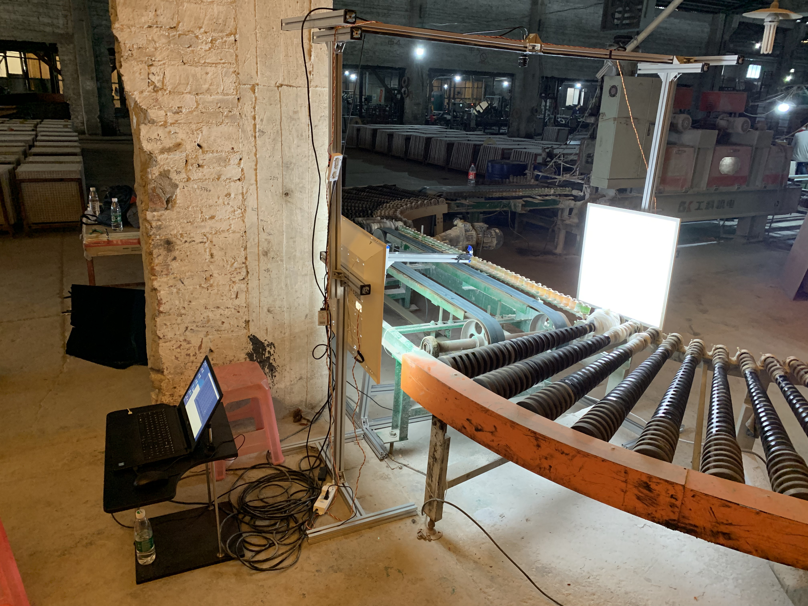

Color Classification System for ceramic tiles.
[Live Demo](https://youtu.be/wOHohzjeYyo)

## Gallery

#### Studio 
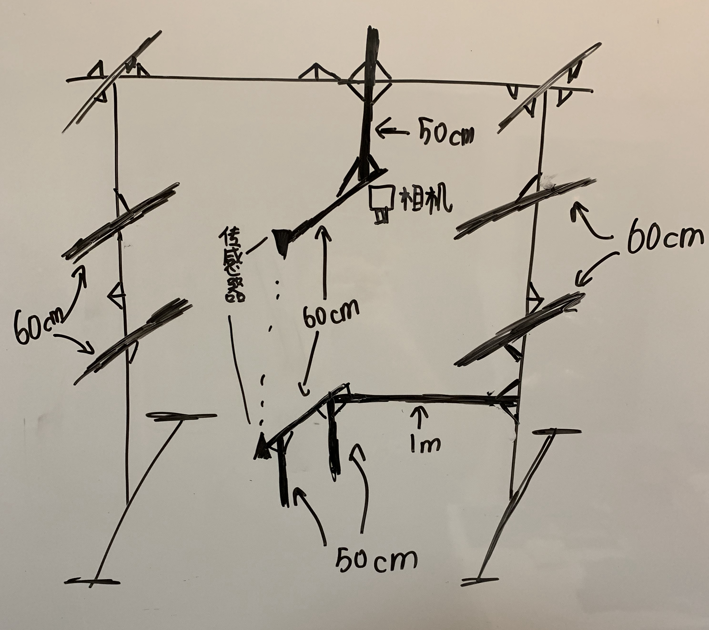
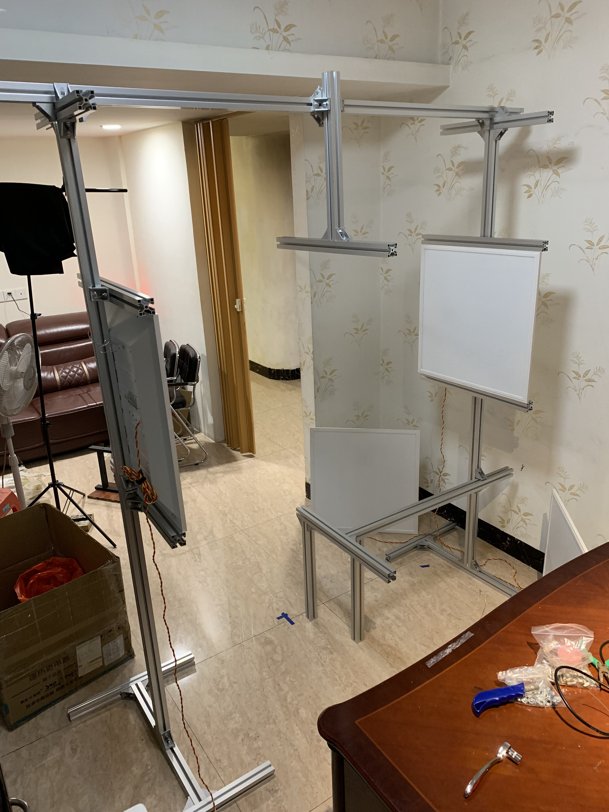
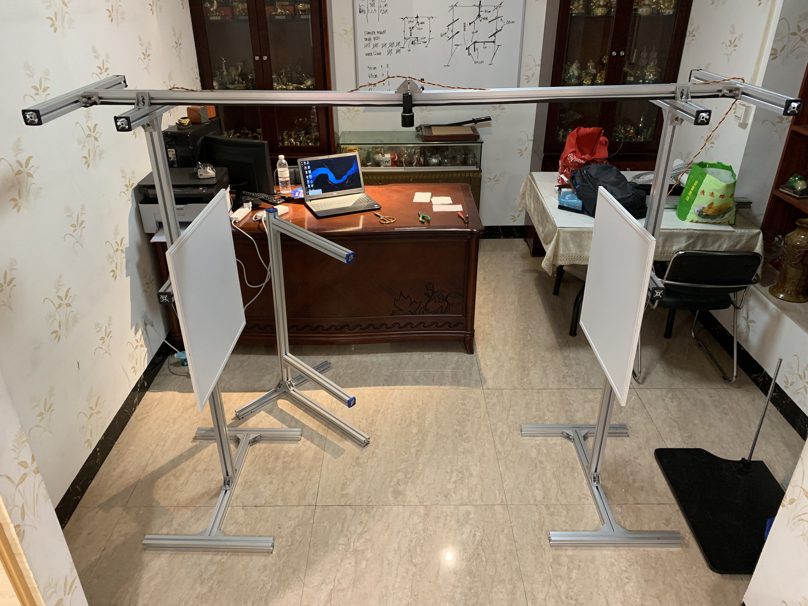
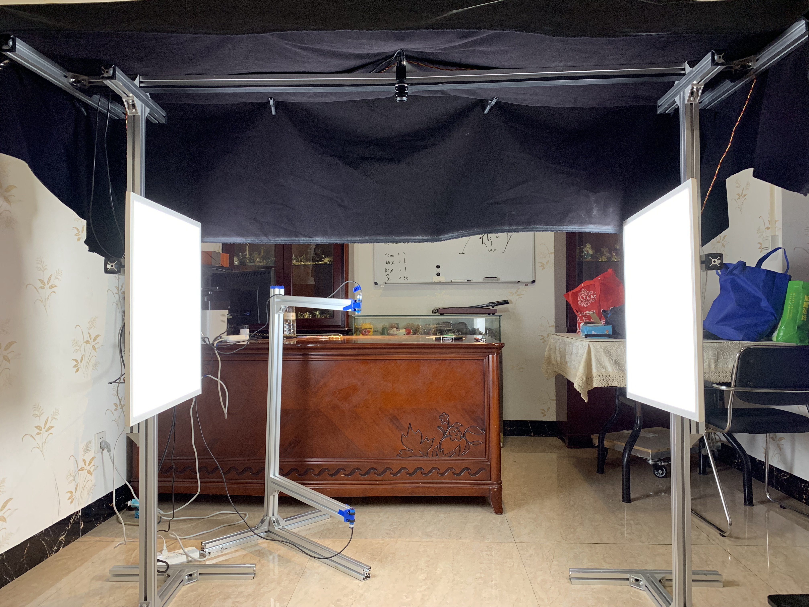

#### Second Factory Visit
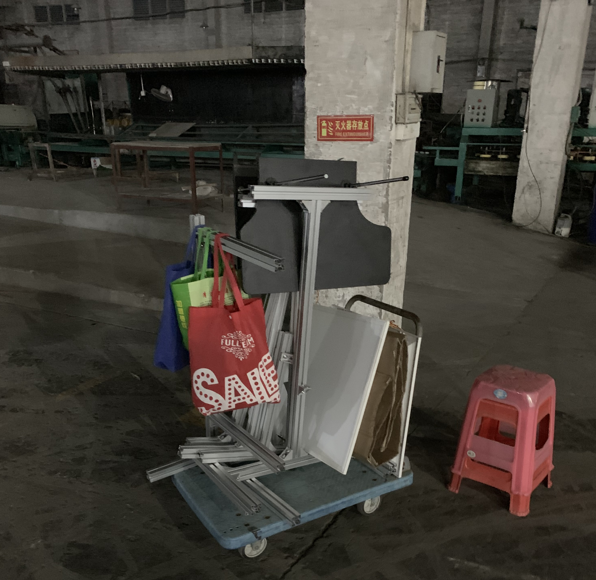
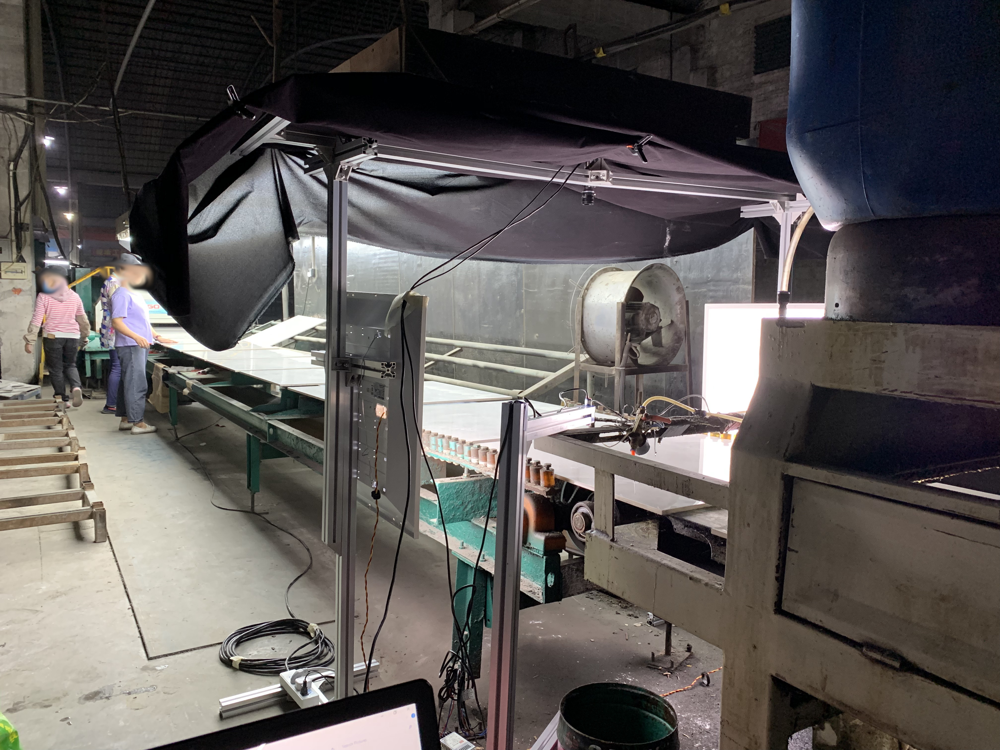
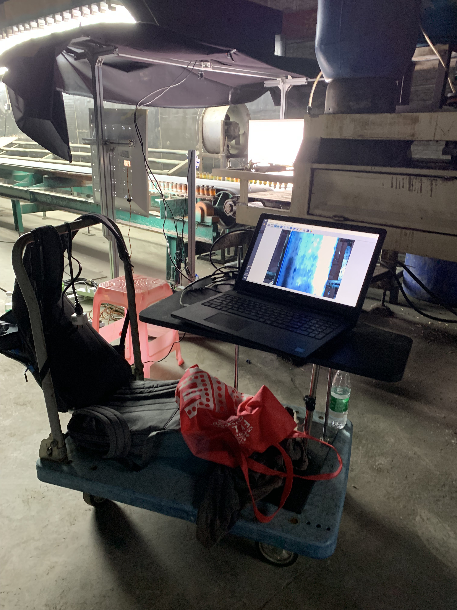

#### Third Factory Visit
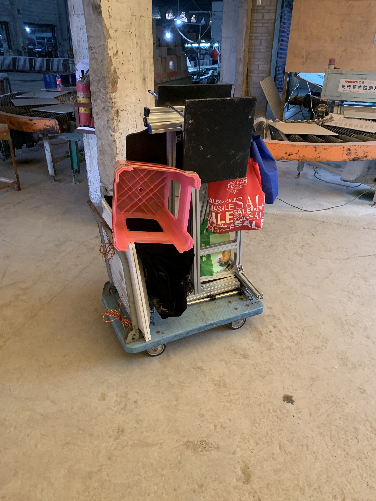

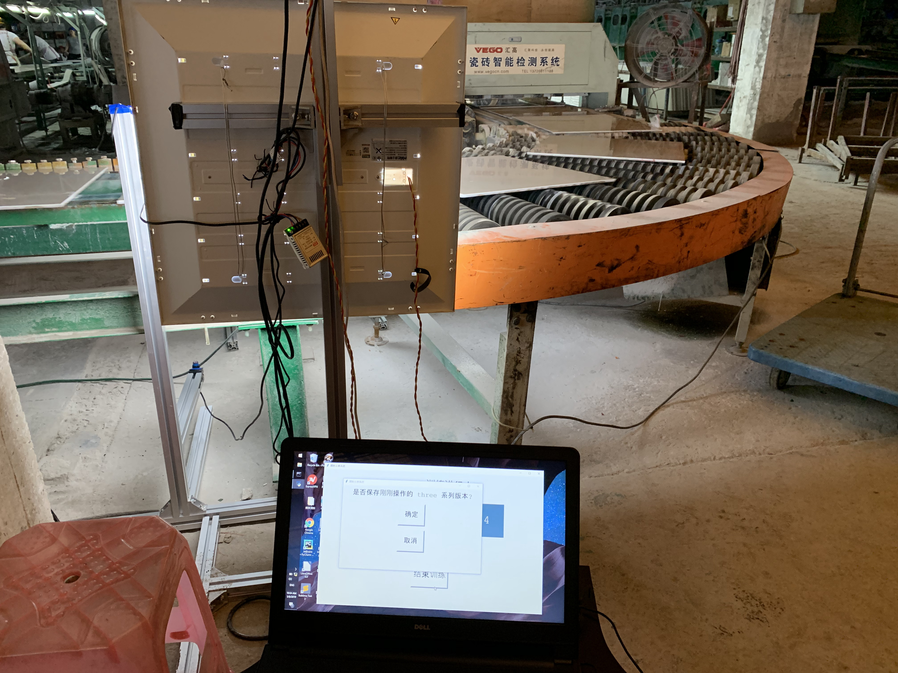

#### Fourth Factory Visit
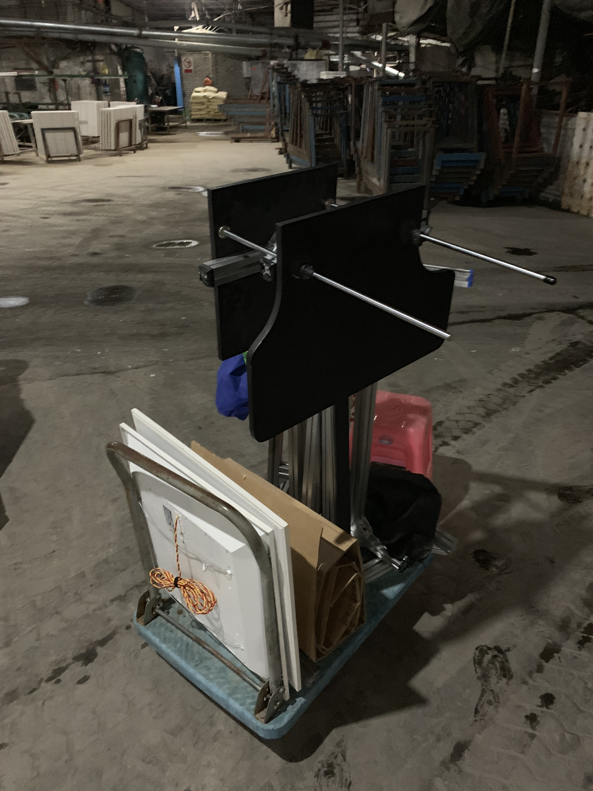
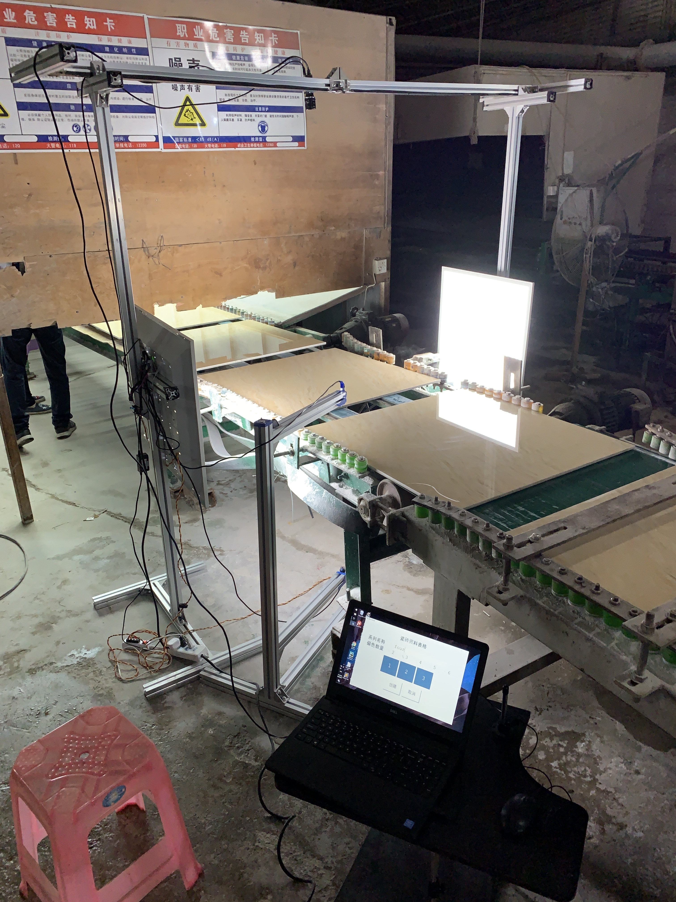

## Requirments
- the **sample collection and labeling GUI** must be run on a computer with **Windows Operating System**.
- **camera used: https://item.taobao.com/item.htm?spm=a1z09.2.0.0.6fc72e8daIwtBu&id=556775402346&_u=q3q3dtnf74c2** 

## Work Flow
1. Setup workstation (with camera and sensors), connect to power, and connect to computer
2. run `python TileClassifierGUI.py` to open label collection GUI
3. create a new tile series
4. start training that series
5. as tiles pass through the sensors, a picture is taken, use cursor to select the identified label for the tile.
6. complete process.
7. call the appropriate functions at the bottom of `DataFrameOps.py` to convert the image set just collected to DataFrames.
8. load the DataFrames in `Main.py` to begin the ML work.

## Core Files 
#### DataFrameOps.py
- DataFrame Operations
- contains the functions to convert images sets to features and store them as pickled pandas dataFrames.

#### DataSetOps.py
- Data Set Operations
- contains the function that work with with pandas dataFrames to form different pandas dataFrames.
- example usage is to extract a subset of rows from a full on pandas dataFrame.

#### Main.py
- Main workhorse of the entire program. ties everything together.
- use it to perform all the functionality you want to test and run.
- import all the functionality you plan to run at the top of the file.
- for example, pull up a data set, truncate it, train it on classifiers, evaluate it.
- see commented out sections of this file for example usage.

#### TestROI.py
- a tiny utility program used to test the region of interest cropping values, to see if it adequately captures the target.

#### TileClassifierGUI.py
- GUI program used to collect and label samples live on the factory production line.
- makes use of the industrial camera. 

## Directories
#### Algorithms
- contains constructor code for 15 supervised algorithms with a default set of parameters 
    - ada boosting (decision tree)
    - bagging classifier (decision tree)
    - decision tree 
    - extra trees 
    - gradient boosting 
    - k nearest neighbors
    - linear support vector classifier
    - support vector classifier (linear kernel)
    - support vector classifier (polynomial kernel)
    - support vector classifier (RBF kernel) 
    - logistic stochastic gradient descent
    - pasting (decision tree)
    - random forrest
    - random patches (decision tree)
    - random subspaces (decision tree)

#### Camera
- CameraThread class that operates the camera based on the industrial camera API. 
- python wrapper for industrial camera API; only works on windows environment, camera needs to connect to computer.

#### DataFrames
- contains extracted feature sets, kept in the format of pickled pandas dataFrames.

#### Evaluation
- cross validation and performance evaluation methods.

#### FeatureExtraction
- contains several functions that convert raw images into different feature sets.

#### References 
- contains boilerplate code and experimental features.

#### Utilities
- contains utility programs used for label generation, image cropping, random sampling, uniform sampling.

