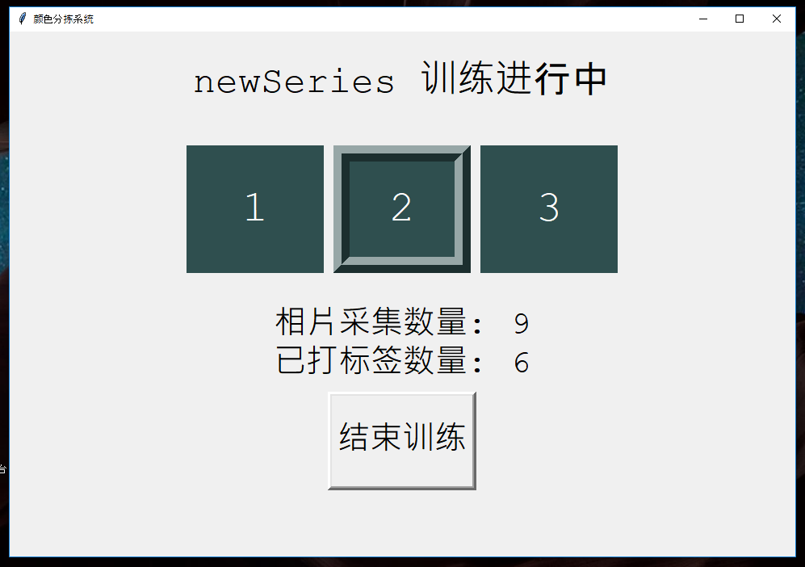
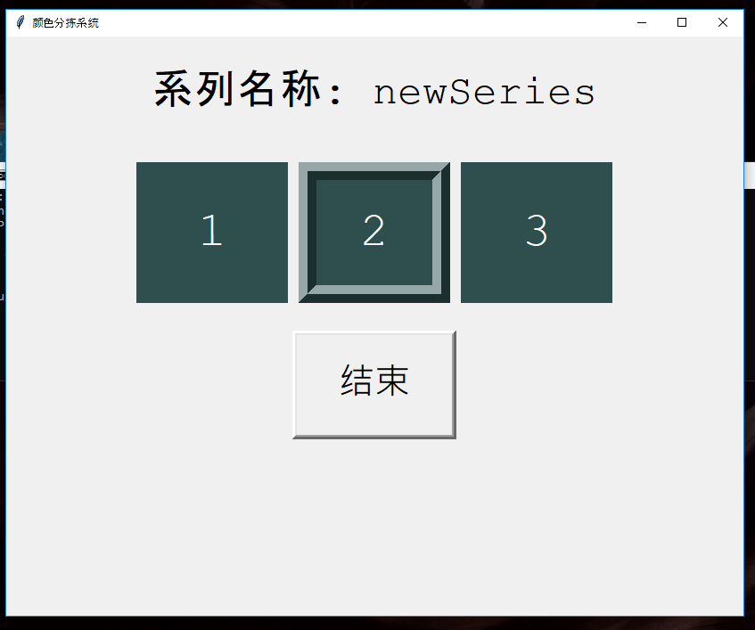

# ProgramOne

Color Classification System for ceramic tiles on 60 tiles/minute production line.
[Live Video Demo](https://youtu.be/wOHohzjeYyo)

## Gallery

#### Studio 

#### Second Factory Visit

#### Third Factory Visit

#### Fourth Factory Visit

## Requirements
- The **sample collection and labeling GUI** must be run on a computer with **Windows Operating System**.
- **[Camera used](https://item.taobao.com/item.htm?spm=a1z09.2.0.0.6fc72e8daIwtBu&id=556775402346&_u=q3q3dtnf74c2)** 

## Software Demo 
1. Setup workstation (with camera and sensors), connect to power, and connect to computer
2. Update the file paths in `TileClassiferGUI.py` to your setup.

3. Run `python TileClassifierGUI.py` to open label collection GUI.

4. Training Menu.

5. Click on the "Create" (新建) button to arrive to this form page.

6. Click "Create New" (创建) to create the series and begin sample collection.

7. At this point, we rely on our work station to detect and take photos of ceramic tiles on the production line.
 We set it up so that when a tile passes between our break beam sensor pair, a signal triggers an image to be capture.
 We also send a signal to indicate to the program that an image was taken. So the indicator for images take is incremented.
 Notice in the previous image, the indicator（相片采集数量）was 0 and it is now 9; this means 9 images were taken. 
 The other indicator (已打标签数量) is for the number of labels made. Right now I am hovering over the label 2 as I plan 
 to label this tile with 2.

8. After clicking 2, I have incremented the indicator（已打标签数量）by 1; it is now 7.

9. I will now end the session by clicking the "End Training" (结束训练) button. Which leads to a prompt on whether or not I 
want to save the current training batch. I chose "Save"（保存).

10. We return to the training menu, this time the newSeries we just created and trained shows up.

11. We can modify it by clicking on "Modify" (更改) button, make sure you select the intended series on the left first.

12. We can delete a series by clicking on the "Delete" (删除) button, make sure you select the intended series. A prompt
will ask for you to confirm your decision. I chose "Cancel" (取消) to stop the deletion.

13. Here is what your console should look like if you followed along.

14. **Intermission:** Feel free to close the GUI. We need to make some changes to the source code, run some
tests, and port in a trained model before getting back into the GUI for the Operations phase.
15. Go to `DataFrameOps.py` and set the series name to the one you created. Also set the rest of the file corresponding
to step 2.

16. Change the batch number in `DataFrameOps.py`.

17. Run `python DataFrameOps.py` and you should have a similar output.

18. Go to `Main.py` and set the batch number accordingly.

19. Set the testing code as shown in `Main.py`.

20. Run `python Main.py` and check how the set of classifiers performed on this data set.

21. In `Main.py` change the testing for loop to just include the best performing classifier.

22. In `Main.py` set the seriesName to match the one you created. 

23. Run `python Main.py` once more to port the model to the database.
24. Run `python TileClassiferGUI.py` to relaunch the GUI and select the "Operation Mode" (运作区) option.

25. Operation Menu.

26. Operating Session.

27. Operating Session, in which the classifier just predicted 2 as the label.

28. Corresponding console feedback during and operating session.

*Feel free to reach out if there are any other concerns*

**Note this was only designed to work for my particular purpose, the hardware setup is a rabbit hole in itself.**

## Core Files 
#### DataFrameOps.py
- DataFrame Operations
- Contains the functions to convert images sets to features and store them as pickled pandas dataFrames.

#### DataSetOps.py
- Data Set Operations
- Contains the function that work with with pandas dataFrames to form different pandas dataFrames.
- Example usage is to extract a subset of rows from a full on pandas dataFrame.

#### Main.py
- Main workhorse of the entire program. ties everything together.
- Use it to perform all the functionality you want to test and run.
- Import all the functionality you plan to run at the top of the file.
- For example, pull up a data set, truncate it, train it on classifiers, evaluate it.
- See commented out sections of this file for example usage.

#### TestROI.py
- A tiny utility program used to test the region of interest cropping values, to see if it adequately captures the target.

#### TileClassifierGUI.py
- GUI program used to collect and label samples live on the factory production line.
- Makes use of the industrial camera. 

## Directories
#### Algorithms
- Contains constructor code for 15 supervised algorithms with a default set of parameters 
    - Ada boosting (decision tree)
    - Bagging classifier (decision tree)
    - Decision tree 
    - Extra trees 
    - Gradient boosting 
    - K nearest neighbors
    - Linear support vector classifier
    - Support vector classifier (linear kernel)
    - Support vector classifier (polynomial kernel)
    - Support vector classifier (RBF kernel) 
    - Logistic stochastic gradient descent
    - Pasting (decision tree)
    - Random forrest
    - Random patches (decision tree)
    - Random subspaces (decision tree)

#### Camera
- CameraThread class that operates the camera based on the industrial camera API. 
- Python wrapper for industrial camera API; only works on windows environment, camera needs to connect to computer.

#### DataFrames
- Contains extracted feature sets, kept in the format of pickled pandas dataFrames.

#### Evaluation
- Cross validation and performance evaluation methods.

#### FeatureExtraction
- Contains several functions that convert raw images into different feature sets.

#### References 
- Contains boilerplate code and experimental features.

#### Utilities
- Contains utility programs used for label generation, image cropping, random sampling, uniform sampling.

